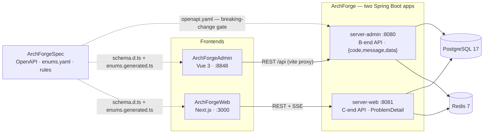
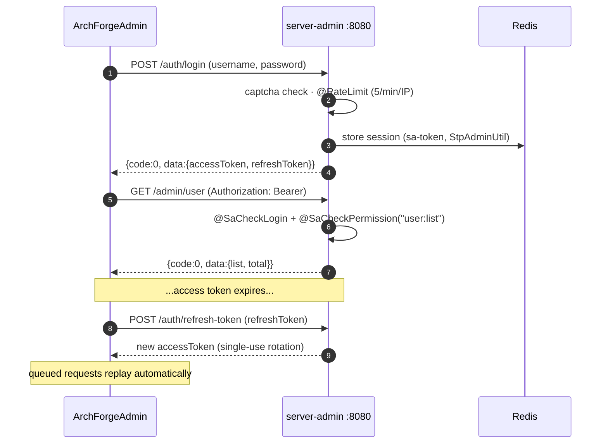
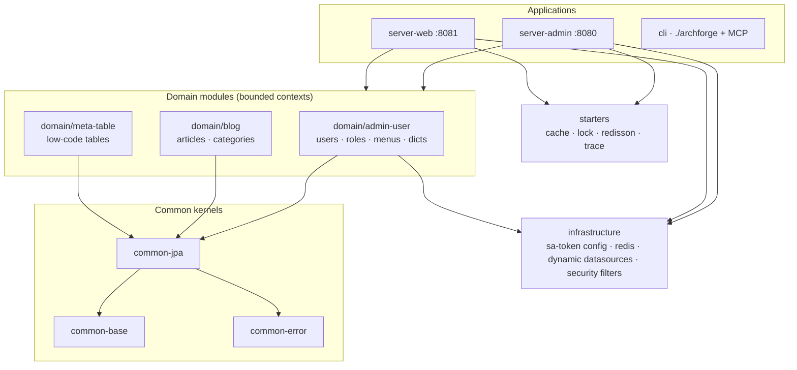
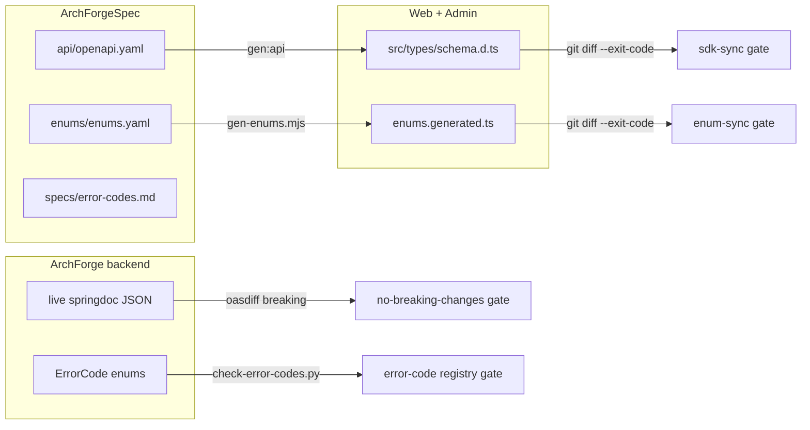
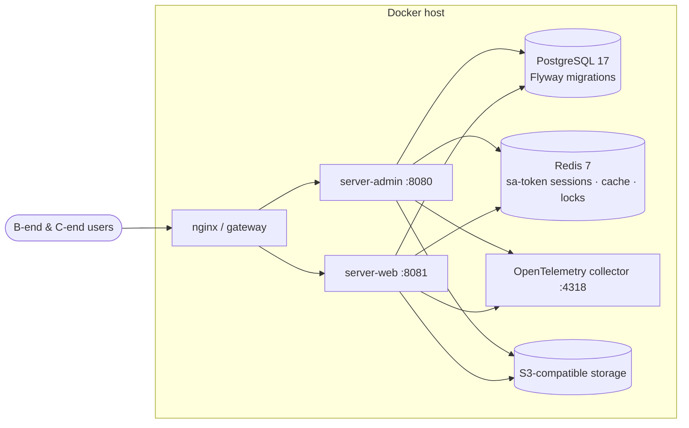

# Architecture

ArchForge is five sibling Git repositories. This page explains **how the pieces fit together**, how a request travels through the backend, and which CI gates keep implementations honest against contracts.

## System context

Two Spring Boot apps are built from one backend codebase, each with its own sa-token realm and response style. The Spec repo is the shared constitution — its OpenAPI file and enum registry feed both frontends via generated TypeScript.

Key consequences of this layout:

- **No cross-calls between the two apps.** `server-web` never imports `server-admin` code; an ArchUnit rule fails the build if that ever happens.
- **Frontends never hand-write API types.** `pnpm gen:api` regenerates them from `openapi.yaml`, and CI fails when committed artifacts drift.
- **Deleted paths stay deleted.** `/system/menu` and `/system/role` are gone from the contract and cannot reappear in a controller.

## Request lifecycle (admin)

A typical authenticated admin request — token issuance, the refresh queue, and permission checks:

On the C-end the same job is done by `StpWebUtil` + `WebAuthInterceptor`; errors come back as RFC 9457 ProblemDetail with an ArchForge error code property instead of the admin envelope.

## Backend module layering

One Gradle root, layered modules. Arrows point in the allowed dependency direction:

The layering is not a drawing — it is enforced by [`ArchitectureTest`](https://github.com/sofn/ArchForge/blob/main/archforge-server-admin/src/test/java/com/lesofn/archforge/server/admin/architecture/ArchitectureTest.java):

- controllers must not touch repositories directly,
- domain modules must not depend on server packages,
- starters must stay business-free,
- every rule fails when it matches zero classes (`failOnEmptyShould=true`), so a typo'd package filter cannot silently disable architecture checks.

## Contract-first workflow

Contracts change in the Spec repo first; code follows. Every arrow below ends in a CI gate:

To add or change an endpoint: edit `openapi.yaml`, implement it behind controllers/services, export the live springdoc document (`OpenApiSnapshotTest`), and let `oasdiff` prove nothing broke for existing consumers.

## Deployment topology

Development and production both start from `docker/` compose files:

Details per environment live in the deployment guides ([Docker](/deploy/docker), [observability](/deploy/observability), [production](/deploy/production)).

## Quality gates summary

| Concern | Enforcement |
|---------|-------------|
| Module boundaries | Spring Modulith verification + ArchUnit |
| Coverage | aggregated JaCoCo; changed-line coverage ≥ 60% on PRs |
| Test tiers | JUnit `@Tag`: `P0` / `P1` / `contract` / `slow` (container tests) |
| Contract drift | oasdiff + sdk-sync + enum-sync + error-code registry |
| Style | Spotless, JSpecify `@NullMarked` on every package |
