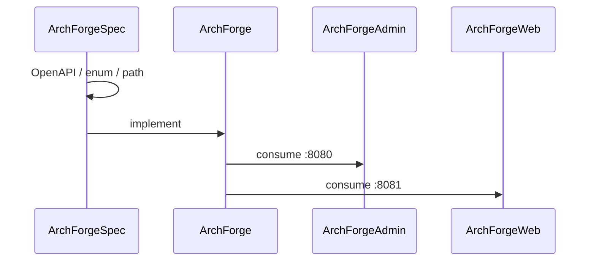

# Contract-first

ArchForge's largest structural choice is a **Spec repository**. Code does not invent APIs. Agents and humans read the same files.

Machine-readable map: sibling clone `../ArchForgeSpec/repos.yaml`. Human architecture: `../ArchForgeSpec/architecture.md`.

## What Spec owns

| File | Role |
|------|------|
| `repos.yaml` | Five-repo map, ports, `can_modify` |
| `api/openapi.yaml` | Live HTTP surface we are willing to document |
| `enums/enums.yaml` | Shared numeric enums (backend is producer) |
| `specs/api-path.md` | Prefixes and live path index |
| `specs/enum-sync.md` | Java enum → yaml → TypeScript |
| `specs/security.md` | sa-token, permissions, rate limit, XSS |
| `skills/index.yaml` | Progressive-disclosure agent skills |

Deleted paths (`/system/menu`, `/system/role`) are tombstones. Do not reintroduce them.

## Change order

1. Change Spec first if a client cannot fit the current contract.
2. Implement in ArchForge in the same series.
3. Update Admin and/or Web consumers.
4. Docs describe; they do not invent endpoints.

## Dual envelope

| Server | Port | Success | Errors |
|--------|------|---------|--------|
| `archforge-server-admin` | 8080 | `{code, message, data}` | Admin envelope or ProblemDetail on 401/403 |
| `archforge-server-web` | 8081 | wrapped payload | RFC 9457 ProblemDetail |

Do not point Admin at `:8081` or Web at `:8080`. See [ADR 0001](/reference/adr/0001-dual-servers).

## Enums

Backend Java enum is the producer. `enums.yaml` is the contract. Frontends must not keep a private numeric mapping (the old vue-pure-admin `0/1/2/3` menu types are forbidden). Buttons on menus are `is_button`, not a `menu_type` value.

## For agents

1. Read `repos.yaml`.
2. Load only the skill in `skills/index.yaml` that matches the task.
3. If an endpoint is missing from `openapi.yaml`, stop and raise Spec — do not hack a client around it.
