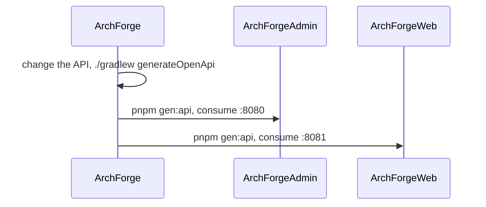

# Contract-first

The contract is owned by the backend repository and generated from the code, so it cannot drift from what the servers actually serve. Agents and humans read the same files. (A separate ArchForgeSpec repository used to hold it; it was merged into ArchForge — [ADR-0012](https://github.com/sofn/ArchForge/blob/main/docs/adr/0012-sibling-repositories.md).)

Machine-readable map: `ArchForge/repos.yaml`. Human architecture: `ArchForge/docs/architecture.md`.

## What ArchForge owns

| File | Role |
|------|------|
| `repos.yaml` | Four-repo map, ports, `can_modify` |
| `spec/openapi.yaml` | Live HTTP surface — **generated** by `./gradlew generateOpenApi`, never hand-edited; CI fails on drift |
| `spec/enums.yaml` | Shared numeric enums (the backend is the producer) |
| `docs/specs/api-path.md` | Prefixes and live path index |
| `docs/specs/enum-sync.md` | Java enum → yaml → TypeScript |
| `docs/specs/security.md` | sa-token, permissions, rate limit, data scope, dynamic SQL |
| `.agents/skills/index.yaml` | Progressive-disclosure agent skills |

Deleted paths (`/system/menu`, `/system/role`) are tombstones. Do not reintroduce them.

## Change order

```mermaid
sequenceDiagram
  participant Backend as ArchForge
  participant Admin as ArchForgeAdmin
  participant Web as ArchForgeWeb
  Backend->>Backend: change the API, ./gradlew generateOpenApi
  Backend->>Admin: pnpm gen:api, consume :8080
  Backend->>Web: pnpm gen:api, consume :8081
```

1. Change the API in ArchForge and regenerate `spec/openapi.yaml` in the same commit.
2. Merge ArchForge first — the clients' CI checks their generated types against ArchForge `main`.
3. Regenerate the types in Admin and/or Web (`pnpm gen:api`) and update the consumers.
4. Docs describe; they do not invent endpoints.

## Dual envelope

| Server | Port | Success | Errors |
|--------|------|---------|--------|
| `archforge-server-admin` | 8080 | `{code, message, data}` | Admin envelope or ProblemDetail on 401/403 |
| `archforge-server-web` | 8081 | wrapped payload | RFC 9457 ProblemDetail |

Do not point Admin at `:8081` or Web at `:8080`. See [ADR-0006](https://github.com/sofn/ArchForge/blob/main/docs/adr/0006-dual-process-topology.md).

## Enums

Backend Java enum is the producer. `enums.yaml` is the contract. Frontends must not keep a private numeric mapping (the old vue-pure-admin `0/1/2/3` menu types are forbidden). Buttons on menus are `is_button`, not a `menu_type` value.

## For agents

1. Read `ArchForge/repos.yaml`.
2. Load only the skill in `ArchForge/.agents/skills/index.yaml` that matches the task.
3. If an endpoint is missing from `spec/openapi.yaml`, add it in the backend first — do not hack a client around it.
