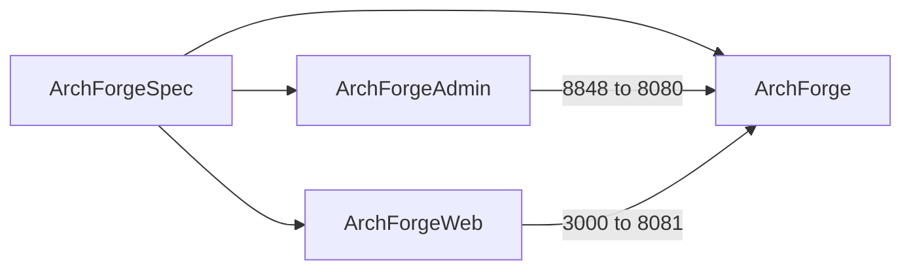

# What is ArchForge?

ArchForge is a **contract-first** enterprise platform split across **five sibling Git repositories**: a Spring Boot 4.1 backend, a Vue 3 admin UI, a Next.js C-end, this VitePress site, and a Spec repo that AI agents read first.

It is not “another RuoYi with a newer JDK”. The product bet is **shared constitution + dual servers + AI-native docs**.

## Why ArchForge?

Java admin templates still win on feature count. ArchForge wins on **how work is specified**:

- A Spec repo (`repos.yaml`, OpenAPI, enums, skills) that humans and agents share
- Two Spring Boot apps with two auth realms and two error envelopes
- DDD modules with Spring Modulith **2.1.0** boundary checks
- Per-repo `AGENTS.md` and a CLI that can install skills / speak MCP

Version numbers move. yudao (RuoYi-Vue-Pro) already ships Spring Boot 4.1 + JDK 25 on `master-jdk25` (their [2026-06 changelog](https://doc.iocoder.cn/changelog/2026-06/)). We do not pretend otherwise.

### Core Highlights

- **Spring Boot 4.1.0 + Java 25** — virtual threads; optional Liberica NIK Native Image (~100ms start)
- **Sa-Token 1.45.0** — `StpAdminUtil` (`:8080`) and `StpWebUtil` (`:8081`); not Spring Security JWT
- **Vue 3 + Vite 8** admin on `:8848` → `:8080`
- **Next.js C-end** on `:3000` → `:8081`
- **Developer CLI** — `./archforge` from the backend root
- **Flyway 12.4.0**, dynamic datasource, OpenTelemetry **1.62.0**
- **Spring Modulith 2.1.0** — module boundaries and documentation tests

## Five sibling repositories

Clone them **side by side**. No git submodules.

```
workspace/
├── ArchForge/          # backend: admin :8080 + web :8081
├── ArchForgeAdmin/     # admin client — consumes :8080
├── ArchForgeWeb/       # C-end — consumes :8081
├── ArchForgeDocs/      # this site
└── ArchForgeSpec/      # contracts / architecture / AI context
```



| Repository | Role | How you run it |
|------------|------|----------------|
| [ArchForge](https://github.com/sofn/ArchForge) | Gradle backend | `./gradlew :archforge-server-admin:bootRun` or `./archforge up` |
| [ArchForgeAdmin](https://github.com/sofn/ArchForgeAdmin) | Admin UI | `pnpm dev` → `http://localhost:8848` |
| [ArchForgeWeb](https://github.com/sofn/ArchForgeWeb) | C-end UI | `pnpm dev` → `http://localhost:3000/en` |
| [ArchForgeDocs](https://github.com/sofn/ArchForgeDocs) | Docs | `npm run docs:dev` |
| [ArchForgeSpec](https://github.com/sofn/ArchForgeSpec) | Constitution | Read-only until a contract must change |

API envelopes:

- **Admin (`:8080`)** `{code, message, data}`
- **Web (`:8081`)** RFC 9457 `ProblemDetail` on errors

## Comparison (architecture, not version scoreboard)

Comparison data dated **2026-04**. Competitor versions change; check their changelogs.

| Dimension | ArchForge | Typical Java admin templates |
|-----------|-----------|------------------------------|
| Source of truth | Dedicated Spec repo + OpenAPI + enums.yaml | Wiki / scattered Swagger |
| Layout | Five sibling Git repos, no submodules | One monorepo or backend+UI pair |
| Auth | sa-token, two realms | Spring Security JWT, one realm |
| Errors | Dual envelope (admin wrap vs ProblemDetail) | One `{code,msg,data}` everywhere |
| Domain | DDD modules + Modulith 2.1.0 | Layered packages + MyBatis XML |
| Agents | AGENTS.md, Spec skills, CLI MCP | Optional README |
| Runtime | Spring Boot 4.1 + JDK 25 (same class as yudao `master-jdk25`) | Mix of Boot 2/3/4 depending on branch |

## Who is it for?

- Teams who want Admin + C-end with **separate auth**
- Groups that will use coding agents and need a constitution those agents cannot ignore
- People who prefer JPA metamodel queries over MyBatis XML

## Next

- [Contract-first](./contract-first.md)
- [AI workflow](./ai-workflow.md)
- [ADRs](../reference/adr/)
- [Project structure](./project-structure.md)
