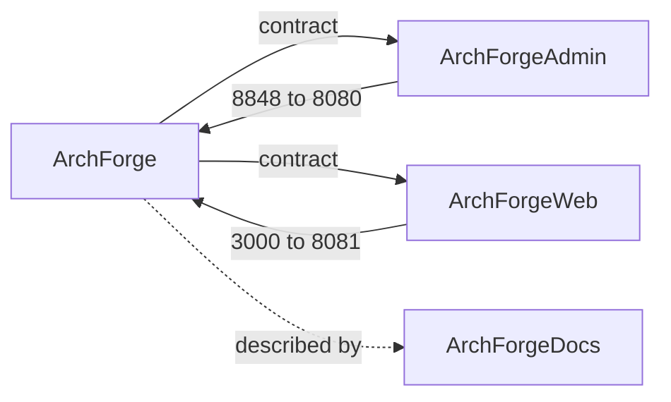

# Project Structure

ArchForge is **four independent Git repositories** cloned side by side. The backend is a domain-driven, multi-module
Gradle build; every Gradle module name is prefixed with `archforge-`. `ArchForge/repos.yaml` is the machine-readable
version of this page.

## Four sibling repositories

```
workspace/
├── ArchForge/          # backend (admin :8080 + web :8081), the API contract (spec/), AI context (.agents/)
├── ArchForgeAdmin/     # admin UI (vue-pure-admin) :8848 → :8080
├── ArchForgeWeb/       # C-end UI (Next.js) :3000 → :8081
└── ArchForgeDocs/      # this VitePress site
```

There are no git submodules. The contract lives in the backend repo and is generated from the code; this site only
describes it. (A fifth repository, ArchForgeSpec, was merged into ArchForge —
[ADR-0012](https://github.com/sofn/ArchForge/blob/main/docs/adr/0012-sibling-repositories.md).)



## Backend (ArchForge)

```
ArchForge/
├── archforge, archforge.bat          # CLI launcher (./archforge)
├── archforge-cli/                    # picocli developer CLI (no Spring)
├── archforge-dependencies/           # java-platform BOM — every library version
├── archforge-common/                 # kernel: no business knowledge
│   ├── archforge-common-base/        # utilities, enums, encryption, Jackson
│   ├── archforge-common-error/       # ErrorCode, ErrorInfo, exception hierarchy
│   └── archforge-common-jpa/         # the single EntityManagerFactory, QueryHelp / SafeExpr,
│                                     #   Flyway (db/migration/__root + module orchestrator)
├── archforge-infrastructure/         # sa-token (StpAdminUtil / StpWebUtil), data scope, file storage,
│                                     #   rate limit, repeat submit, CORS, error handling
├── archforge-starters/               # cache / lock / redisson / trace / request-log (business-free)
├── archforge-builtin/                # platform capabilities (L3)
│   ├── archforge-admin-user/         # users, roles, menus, depts, dict, logs, notices, scheduler jobs
│   ├── archforge-meta-runtime/       # meta-table model + dynamic CRUD (shipped)
│   └── archforge-meta-designer/      # meta-table designer, DDL, codegen (design time only)
├── archforge-module-cms/             # business domain (L4): articles, categories
├── archforge-module-task/            # business domain (L4): task example
├── archforge-server-admin/           # admin API :8080 — assembles every module
├── archforge-server-web/             # C-end API :8081
├── spec/                             # openapi.yaml (generated), enums.yaml, schemas/
├── docs/                             # adr/, specs/ (standards), architecture.md
├── .agents/                          # skills, memory, change records for AI agents
├── project-definition/meta/          # meta-table definitions as YAML
└── docker/, scripts/                 # compose files, image variants, deploy scripts
```

Every domain module (`archforge-builtin/*`, `archforge-module-*`) has exactly two top-level packages:

- `api` — what other modules may use: domain types, DTOs, service interfaces, error codes;
- `internal` — implementations, including the Spring Data repositories (`internal.dao`). Other modules never reach
  in; they call an `api` service ([ADR-0010](https://github.com/sofn/ArchForge/blob/main/docs/adr/0010-repositories-are-internal.md)).

ArchUnit and Spring Modulith enforce both in the build. New business modules come from
`./archforge module new <name>`, which also registers them in `settings.gradle.kts` and server-admin.

## Frontend (ArchForgeAdmin)

```
ArchForgeAdmin/
├── src/
│   ├── api/                 # API calls (Axios, base URL /api)
│   ├── components/          # shared components (ReDialog, ReIcon, …)
│   ├── directives/          # v-perms and friends
│   ├── layout/              # sidebar, header, tabs
│   ├── router/              # static routes + routes from the backend
│   ├── store/               # Pinia
│   ├── types/schema.d.ts    # generated from ArchForge spec/openapi.yaml (pnpm gen:api)
│   ├── utils/               # auth, http, hasPerms, latestRequest
│   └── views/               # pages
├── locales/                 # i18n
└── vite.config.ts           # dev server :8848, proxy /api → :8080
```

## C-end (ArchForgeWeb)

Next.js App Router application in `apps/web` (pnpm + Turborepo). Dev server `http://localhost:3000`, talking to
`http://localhost:8081`; its `src/types/schema.d.ts` is generated from the contract as well. Details:
[C-end Web](./c-end-web.md).

## Module dependencies

```
archforge-server-admin / archforge-server-web
  ├── archforge-module-* / archforge-builtin/*   (through their api packages only)
  └── archforge-infrastructure
        └── archforge-common/{base, error, jpa}, archforge-starters/*
```

Dependencies point down: kernel (`common`, `infrastructure`) never depends on modules or servers, built-in modules
never depend on business modules, and starters stay business-free.

```bash
./gradlew :archforge-server-admin:bootRun
./gradlew :archforge-server-web:bootRun
./gradlew verify            # every gate across all modules
```

## Key design decisions

The decisions behind this layout are recorded as ADRs in
[`ArchForge/docs/adr`](https://github.com/sofn/ArchForge/tree/main/docs/adr) — see the [ADR index](../reference/adr/).

| Decision | ADR |
|----------|-----|
| Domain modules: `api` + `internal` only | 0001 |
| One EntityManagerFactory per datasource group | 0002 |
| Two server processes (admin / web), all-in-one image | 0006 |
| Repositories are internal | 0010 |
| sa-token instead of Spring Security JWT | 0011 |
| Four sibling repositories | 0012 |
| JPA + static metamodel instead of MyBatis | 0013 |

## Related Pages

- [Tech Stack](./tech-stack.md) — technology choices explained
- [CLI](./cli.md) — `./archforge` commands
- [Configuration](./configuration.md) — YAML config structure
- [Local Development Setup](./local-setup.md) — IDE and tooling
