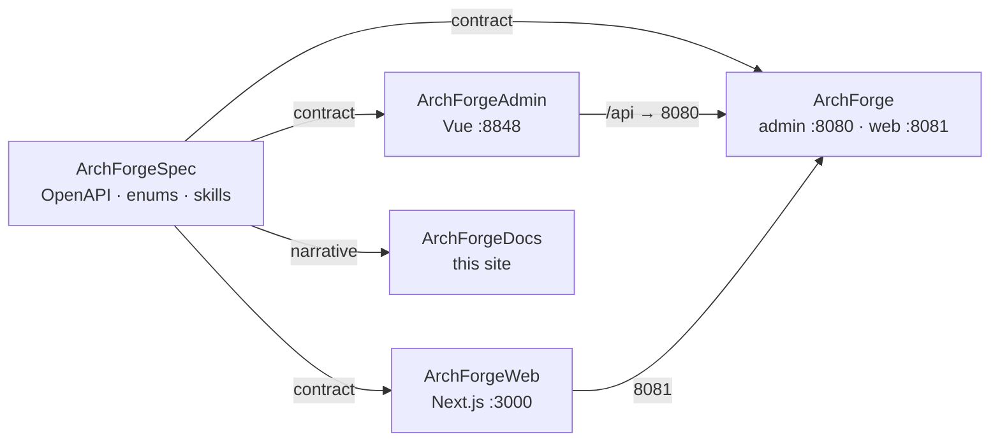

## Why five repositories?

ArchForge is **five independent Git repositories**, cloned side by side. There are no git submodules. The Spec repo is the constitution an AI agent reads first.



| Repository | Role | Local port |
|------------|------|------------|
| **ArchForge** | Backend. `archforge-server-admin` + `archforge-server-web` | `:8080` / `:8081` |
| **ArchForgeAdmin** | Admin UI (vue-pure-admin) | `:8848` → `:8080` |
| **ArchForgeWeb** | C-end (Next.js) | `:3000` → `:8081` |
| **ArchForgeDocs** | This VitePress site | `npm run docs:dev` |
| **ArchForgeSpec** | Contracts / architecture / AI context | — |

Start with [contract-first](/guide/contract-first), then [AI workflow](/guide/ai-workflow). CLI lives in the backend repo: `./archforge`.

## Run it locally

```bash
# siblings, no submodules
git clone https://github.com/sofn/ArchForge.git
git clone https://github.com/sofn/ArchForgeAdmin.git
git clone https://github.com/sofn/ArchForgeWeb.git
git clone https://github.com/sofn/ArchForgeDocs.git
git clone https://github.com/sofn/ArchForgeSpec.git

cd ArchForge
./archforge init --write
./archforge infra up
FILE_STORAGE_TYPE=local ./gradlew :archforge-server-admin:bootRun
```

Admin default login is `admin / admin123` (captcha on in `dev`). There is no hosted public demo yet — run the stack locally or with Docker Compose.
