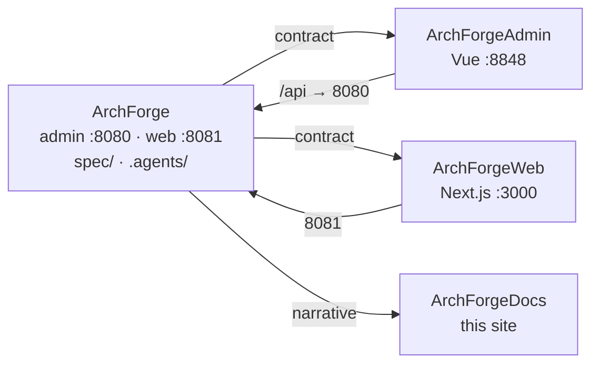

## Why four repositories?

ArchForge is **four independent Git repositories**, cloned side by side. There are no git submodules. The backend repo owns the contract (`spec/openapi.yaml`, generated from the code) and the AI context (`repos.yaml`, `AGENTS.md`, `.agents/`) — an agent reads it first. The former ArchForgeSpec repository was merged into it ([ADR-0012](https://github.com/sofn/ArchForge/blob/main/docs/adr/0012-sibling-repositories.md)).


```mermaid
flowchart LR
  Backend["ArchForge<br/>admin :8080 · web :8081<br/>spec/ · .agents/"]
  Admin["ArchForgeAdmin<br/>Vue :8848"]
  Web["ArchForgeWeb<br/>Next.js :3000"]
  Docs["ArchForgeDocs<br/>this site"]
  Backend -->|contract| Admin
  Backend -->|contract| Web
  Backend -->|narrative| Docs
  Admin -->|/api → 8080| Backend
  Web -->|8081| Backend
```

| Repository | Role | Local port |
|------------|------|------------|
| **ArchForge** | Backend. `archforge-server-admin` + `archforge-server-web` | `:8080` / `:8081` |
| **ArchForgeAdmin** | Admin UI (vue-pure-admin) | `:8848` → `:8080` |
| **ArchForgeWeb** | C-end (Next.js) | `:3000` → `:8081` |
| **ArchForgeDocs** | This VitePress site | `npm run docs:dev` |

<p>
  <a href="https://github.com/sofn/ArchForge"></a>
</p>

Start with [contract-first](/guide/contract-first), then [AI workflow](/guide/ai-workflow). CLI lives in the backend repo: `./archforge`.

## Run it locally

```bash
# siblings, no submodules
git clone https://github.com/sofn/ArchForge.git
git clone https://github.com/sofn/ArchForgeAdmin.git
git clone https://github.com/sofn/ArchForgeWeb.git
git clone https://github.com/sofn/ArchForgeDocs.git

cd ArchForge
./archforge init --write
./archforge infra up
FILE_STORAGE_TYPE=local ./gradlew :archforge-server-admin:bootRun
```

Admin default login is `admin / admin123` (captcha on in `dev`). There is no hosted public demo yet — run the stack locally or with Docker Compose.
