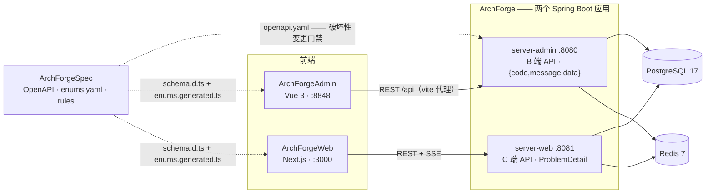
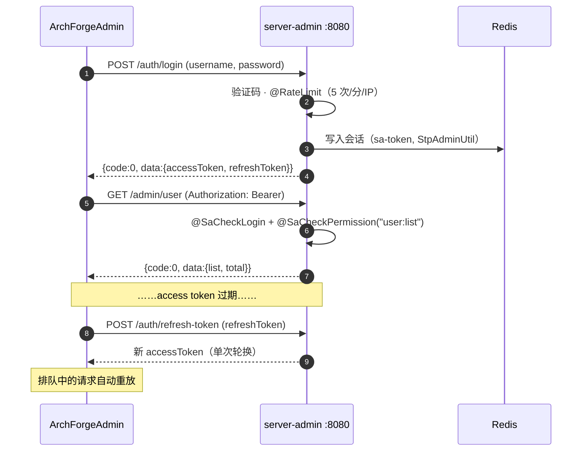
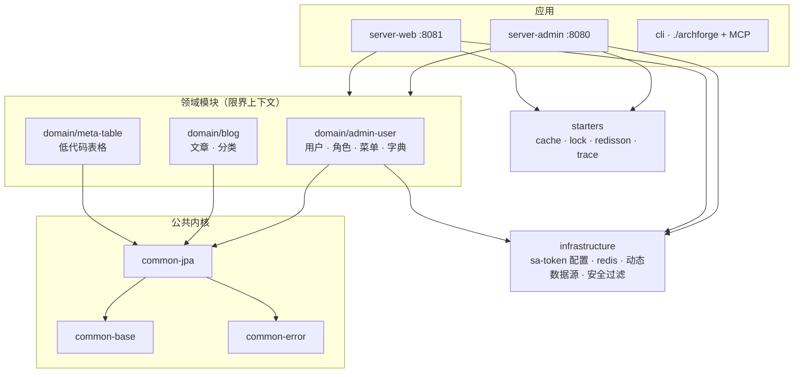
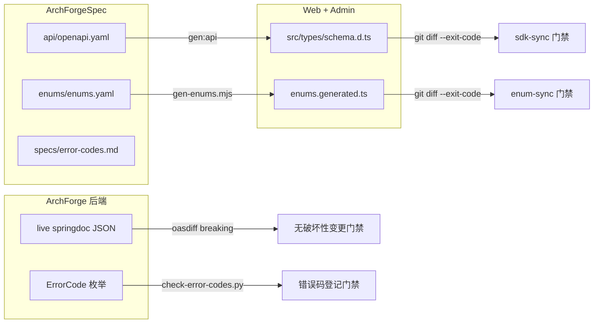
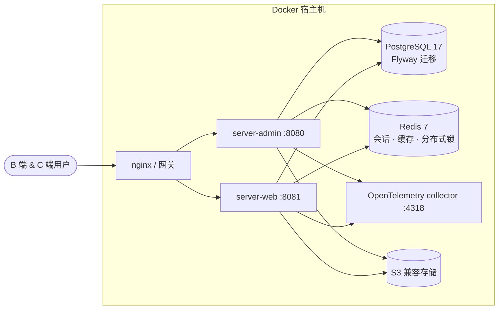

# 系统架构

ArchForge 由五个并列 Git 仓库组成。本页说明**各部分如何协作**：一次请求如何穿过后端、CI 用哪些门禁保证实现不偏离契约。

## 系统上下文

一套后端代码构建两个 Spring Boot 应用，各自拥有独立的 sa-token 认证域与响应风格。Spec 仓库是共同"宪法"——它的 OpenAPI 与枚举登记表通过生成的 TypeScript 喂给两个前端。

这种布局带来的直接约束：

- **两个应用互不调用。** `server-web` 不 import `server-admin` 的代码，违反会被 ArchUnit 规则拦下。
- **前端不手写 API 类型。** `pnpm gen:api` 从 `openapi.yaml` 重新生成，提交物漂移会让 CI 变红。
- **删除的路径保持删除。** `/system/menu`、`/system/role` 已从契约移除，不允许在 Controller 里复活。

## 请求链路（管理端）

一次典型的带认证请求 —— 令牌签发、刷新队列与权限校验：

C 端由 `StpWebUtil` + `WebAuthInterceptor` 承担同样职责；错误以 RFC 9457 ProblemDetail 返回并附带 ArchForge 错误码属性，而不是管理端 envelope。

## 后端模块分层

一个 Gradle 根、分层模块。箭头方向即允许的依赖方向：

分层不是一张画 —— 它由 [`ArchitectureTest`](https://github.com/sofn/ArchForge/blob/main/archforge-server-admin/src/test/java/com/lesofn/archforge/server/admin/architecture/ArchitectureTest.java) 强制执行：

- Controller 不允许直接触碰 Repository；
- 领域模块不允许依赖 server 包；
- starters 必须与业务无关；
- 任何规则匹配到 0 个类时直接失败（`failOnEmptyShould=true`），包名写错不会让架构检查静默失效。

## 契约先行工作流

契约永远先改 Spec 仓库；代码随后跟上。下面每条箭头的终点都是一个 CI 门禁：

新增或修改接口的路径：先改 `openapi.yaml` → 在 controller/service 后面实现 → 用 `OpenApiSnapshotTest` 导出 live springdoc 文档 → 让 `oasdiff` 证明对既有消费方零破坏。

## 部署拓扑

开发与生产都从 `docker/` 下的 compose 文件出发：

各环境细节见部署指南（[Docker](/zh/deploy/docker)、[可观测性](/zh/deploy/observability)、[生产环境](/zh/deploy/production)）。

## 质量门禁一览

| 关注点 | 强制手段 |
|--------|----------|
| 模块边界 | Spring Modulith 校验 + ArchUnit |
| 覆盖率 | 聚合 JaCoCo；PR 变更行覆盖率 ≥ 60% |
| 测试分级 | JUnit `@Tag`：`P0` / `P1` / `contract` / `slow`（容器测试） |
| 契约漂移 | oasdiff + sdk-sync + enum-sync + 错误码登记检查 |
| 代码风格 | Spotless、每个包 JSpecify `@NullMarked` |
