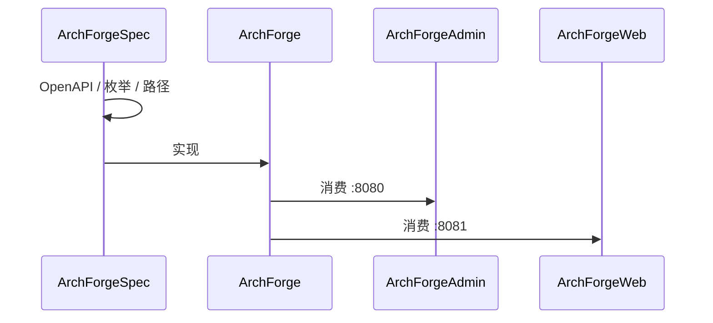

# 契约先行

ArchForge 最大的结构选择是 **Spec 仓库**。代码不发明 API。Agent 和人读同一批文件。

机器可读地图：并列克隆里的 `../ArchForgeSpec/repos.yaml`。人读架构：`../ArchForgeSpec/architecture.md`。

## Spec 拥有什么

| 文件 | 职责 |
|------|------|
| `repos.yaml` | 五仓地图、端口、`can_modify` |
| `api/openapi.yaml` | 我们愿意文档化的 HTTP 面 |
| `enums/enums.yaml` | 共享数值枚举（后端是生产者） |
| `specs/api-path.md` | 前缀与活动路径索引 |
| `specs/enum-sync.md` | Java 枚举 → yaml → TypeScript |
| `specs/security.md` | sa-token、权限、限流、XSS |
| `skills/index.yaml` | Agent skill 渐进披露 |

已删除路径（`/system/menu`、`/system/role`）是墓碑，禁止复活。

## 变更顺序

1. 客户端对不上契约时，先改 Spec。
2. 同一系列变更在 ArchForge 实现。
3. 更新 Admin / Web 消费方。
4. 文档只描述，不发明端点。

## 双信封

| 服务 | 端口 | 成功 | 错误 |
|------|------|------|------|
| `archforge-server-admin` | 8080 | `{code, message, data}` | 管理端信封；401/403 可为 ProblemDetail |
| `archforge-server-web` | 8081 | 包装 payload | RFC 9457 ProblemDetail |

不要把 Admin 指到 `:8081`，也不要把 Web 指到 `:8080`。见 [ADR 0001](/zh/reference/adr/0001-dual-servers)。

## 枚举

后端 Java 枚举是生产者。`enums.yaml` 是契约。前端禁止私有数字映射（vue-pure-admin 的 `0/1/2/3` 菜单类型已禁止）。按钮是 `is_button`，不是 `menu_type`。

## 给 Agent

1. 读 `repos.yaml`。
2. 只加载 `skills/index.yaml` 里匹配当前任务的 skill。
3. `openapi.yaml` 没有的端点：停下来提 Spec，不要在客户端绕过去。
