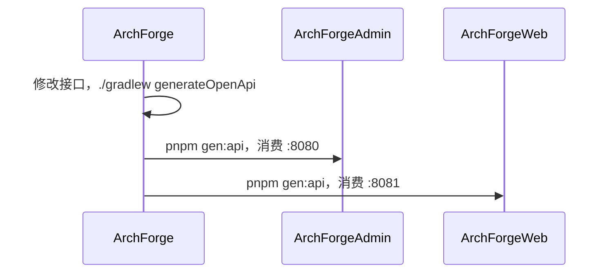

# 契约先行

契约归后端仓所有，并且由代码生成，所以不会和服务实际提供的接口脱节。Agent 和人读同一批文件。（契约以前放在单独的 ArchForgeSpec 仓，现已并入 ArchForge——[ADR-0012](https://github.com/sofn/ArchForge/blob/main/docs/adr/0012-sibling-repositories.md)。）

机器可读地图：`ArchForge/repos.yaml`。人读架构：`ArchForge/docs/architecture.md`。

## ArchForge 拥有什么

| 文件 | 职责 |
|------|------|
| `repos.yaml` | 四仓地图、端口、`can_modify` |
| `spec/openapi.yaml` | 活动 HTTP 面——由 `./gradlew generateOpenApi` **生成**，禁止手改；CI 发现漂移即失败 |
| `spec/enums.yaml` | 共享数值枚举（后端是生产者） |
| `docs/specs/api-path.md` | 前缀与活动路径索引 |
| `docs/specs/enum-sync.md` | Java 枚举 → yaml → TypeScript |
| `docs/specs/security.md` | sa-token、权限、限流、数据范围、动态 SQL |
| `.agents/skills/index.yaml` | Agent skill 渐进披露 |

已删除路径（`/system/menu`、`/system/role`）是墓碑，禁止复活。

## 变更顺序

```mermaid
sequenceDiagram
  participant Backend as ArchForge
  participant Admin as ArchForgeAdmin
  participant Web as ArchForgeWeb
  Backend->>Backend: 修改接口，./gradlew generateOpenApi
  Backend->>Admin: pnpm gen:api，消费 :8080
  Backend->>Web: pnpm gen:api，消费 :8081
```

1. 在 ArchForge 修改接口，并在同一个提交里重新生成 `spec/openapi.yaml`。
2. 先合入 ArchForge——客户端 CI 会拿生成的类型对照 ArchForge `main` 检查。
3. 在 Admin / Web 重新生成类型（`pnpm gen:api`）并更新调用方。
4. 文档只描述，不发明端点。

## 双信封

| 服务 | 端口 | 成功 | 错误 |
|------|------|------|------|
| `archforge-server-admin` | 8080 | `{code, message, data}` | 管理端信封；401/403 可为 ProblemDetail |
| `archforge-server-web` | 8081 | 包装 payload | RFC 9457 ProblemDetail |

不要把 Admin 指到 `:8081`，也不要把 Web 指到 `:8080`。见 [ADR-0006](https://github.com/sofn/ArchForge/blob/main/docs/adr/0006-dual-process-topology.md)。

## 枚举

后端 Java 枚举是生产者。`enums.yaml` 是契约。前端禁止私有数字映射（vue-pure-admin 的 `0/1/2/3` 菜单类型已禁止）。按钮是 `is_button`，不是 `menu_type`。

## 给 Agent

1. 读 `ArchForge/repos.yaml`。
2. 只加载 `ArchForge/.agents/skills/index.yaml` 里匹配当前任务的 skill。
3. `spec/openapi.yaml` 没有的端点：先在后端补上，不要在客户端绕过去。
