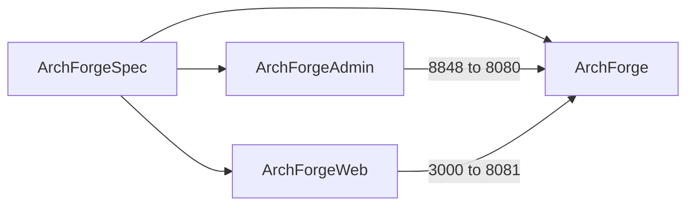

# 什么是 ArchForge？

ArchForge 是一套 **契约先行** 的企业级平台，拆成 **五个并列 Git 仓库**：Spring Boot 4.1 后端、Vue 3 管理端、Next.js C 端、本 VitePress 站点，以及 AI Agent 最先读的 Spec 仓。

它不是「换了新 JDK 的 RuoYi」。产品赌注是 **共享宪法 + 双服务 + AI 原生文档**。

## 为什么选择 ArchForge？

Java 管理模板仍然靠功能数量取胜。ArchForge 靠 **工作如何被规定** 取胜：

- Spec 仓（`repos.yaml`、OpenAPI、枚举、skills）人和 Agent 共用
- 两套 Spring Boot 应用、两套登录域、两套错误信封
- DDD 模块 + Spring Modulith **2.1.0** 边界检查
- 每仓 `AGENTS.md`，CLI 可安装 skill / 作为 MCP

版本号会变。芋道（RuoYi-Vue-Pro）已在 `master-jdk25` 提供 Spring Boot 4.1 + JDK 25（[2026-06 changelog](https://doc.iocoder.cn/changelog/2026-06/)）。我们不假装对手停在 Boot 2。

### 核心亮点

- **Spring Boot 4.1.0 + Java 25** — 虚拟线程；可选 Liberica NIK Native Image（约 100ms 启动）
- **Sa-Token 1.45.0** — `StpAdminUtil`（`:8080`）与 `StpWebUtil`（`:8081`）；不是 Spring Security JWT
- **Vue 3 + Vite 8** 管理端 `:8848` → `:8080`
- **Next.js C 端** `:3000` → `:8081`
- **开发者 CLI** — 后端根目录 `./archforge`
- **Flyway 12.4.0**、动态数据源、OpenTelemetry **1.62.0**
- **Spring Modulith 2.1.0** — 模块边界与文档测试

## 五个并列仓库

**并列克隆**。没有 git submodule。

```
workspace/
├── ArchForge/          # 后端：admin :8080 + web :8081
├── ArchForgeAdmin/     # 管理端 — 调用 :8080
├── ArchForgeWeb/       # C 端 — 调用 :8081
├── ArchForgeDocs/      # 本文档
└── ArchForgeSpec/      # 契约 / 架构 / AI 上下文
```



| 仓库 | 职责 | 如何运行 |
|------|------|----------|
| [ArchForge](https://github.com/sofn/ArchForge) | Gradle 后端 | `./gradlew :archforge-server-admin:bootRun` 或 `./archforge up` |
| [ArchForgeAdmin](https://github.com/sofn/ArchForgeAdmin) | 管理端 UI | `pnpm dev` → `http://localhost:8848` |
| [ArchForgeWeb](https://github.com/sofn/ArchForgeWeb) | C 端 UI | `pnpm dev` → `http://localhost:3000/en` |
| [ArchForgeDocs](https://github.com/sofn/ArchForgeDocs) | 文档 | `npm run docs:dev` |
| [ArchForgeSpec](https://github.com/sofn/ArchForgeSpec) | 宪法 | 契约不变时只读 |

API 信封：

- **管理端（`:8080`）** `{code, message, data}`
- **C 端（`:8081`）** 错误为 RFC 9457 `ProblemDetail`

## 对比（谈架构，不是版本碾压）

对比数据日期 **2026-04**。对手版本会变，请核对其 changelog。

| 维度 | ArchForge | 常见 Java 管理模板 |
|------|-----------|--------------------|
| 事实源 | 独立 Spec 仓 + OpenAPI + enums.yaml | Wiki / 零散 Swagger |
| 布局 | 五个并列 Git 仓，无 submodule | 一个 monorepo 或后端+UI |
| 认证 | sa-token，两个登录域 | Spring Security JWT，一个域 |
| 错误 | 双信封（管理端包装 vs ProblemDetail） | 到处 `{code,msg,data}` |
| 领域 | DDD 模块 + Modulith 2.1.0 | 分层包 + MyBatis XML |
| Agent | AGENTS.md、Spec skills、CLI MCP | 可选 README |
| 运行时 | Spring Boot 4.1 + JDK 25（与芋道 `master-jdk25` 同一档） | 视分支混用 Boot 2/3/4 |

## 适用人群

- 需要管理端 + C 端 **分开认证** 的团队
- 会使用编码 Agent、需要一份 Agent 无法忽略的宪法的团队
- 偏好 JPA 元模型查询而不是 MyBatis XML 的人

## 下一步

- [契约先行](./contract-first.md)
- [AI 协作](./ai-workflow.md)
- [ADR](../reference/adr/)
- [项目结构](./project-structure.md)
