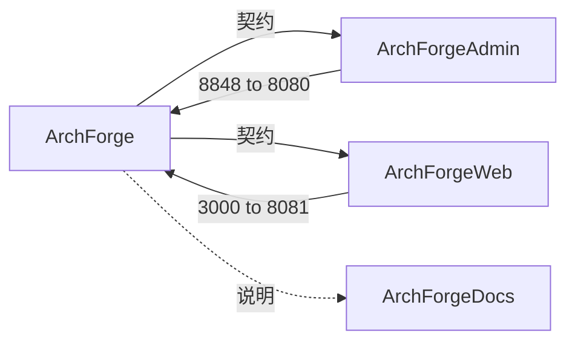

# 项目结构

ArchForge 由 **四个独立 Git 仓库** 并列组成。后端是领域驱动的多模块 Gradle 工程，每个 Gradle 模块名都以
`archforge-` 为前缀。`ArchForge/repos.yaml` 是本页的机器可读版本。

## 四个并列仓库

```
workspace/
├── ArchForge/          # 后端（admin :8080 + web :8081）、API 契约（spec/）、AI 上下文（.agents/）
├── ArchForgeAdmin/     # 管理端 UI（vue-pure-admin）:8848 → :8080
├── ArchForgeWeb/       # C 端 UI（Next.js）:3000 → :8081
└── ArchForgeDocs/      # 本 VitePress 站点
```

没有 git submodule。契约在后端仓里、由代码生成；本站只做说明。（原来的第五个仓库 ArchForgeSpec 已并入 ArchForge——
[ADR-0012](https://github.com/sofn/ArchForge/blob/main/docs/adr/0012-sibling-repositories.md)。）



## 后端（ArchForge）

```
ArchForge/
├── archforge, archforge.bat          # CLI 启动脚本（./archforge）
├── archforge-cli/                    # picocli 开发者 CLI（不依赖 Spring）
├── archforge-dependencies/           # java-platform BOM——所有库版本
├── archforge-common/                 # 内核：不含业务知识
│   ├── archforge-common-base/        # 工具、枚举、加密、Jackson
│   ├── archforge-common-error/       # ErrorCode、ErrorInfo、异常体系
│   └── archforge-common-jpa/         # 唯一的 EntityManagerFactory、QueryHelp / SafeExpr、
│                                     #   Flyway（db/migration/__root + 模块编排）
├── archforge-infrastructure/         # sa-token（StpAdminUtil / StpWebUtil）、数据权限、文件存储、
│                                     #   限流、防重复提交、CORS、异常处理
├── archforge-starters/               # cache / lock / redisson / trace / request-log（不含业务）
├── archforge-builtin/                # 平台能力（L3）
│   ├── archforge-admin-user/         # 用户、角色、菜单、部门、字典、日志、公告、定时任务
│   ├── archforge-meta-runtime/       # 元表格模型 + 动态 CRUD（发布）
│   └── archforge-meta-designer/      # 元表格设计器、DDL、代码生成（仅设计期）
├── archforge-module-cms/             # 业务域（L4）：文章、分类
├── archforge-module-task/            # 业务域（L4）：任务示例
├── archforge-server-admin/           # 管理端 API :8080——装配所有模块
├── archforge-server-web/             # C 端 API :8081
├── spec/                             # openapi.yaml（生成）、enums.yaml、schemas/
├── docs/                             # adr/、specs/（规范）、architecture.md
├── .agents/                          # 给 AI Agent 的 skills、memory、变更记录
├── project-definition/meta/          # 元表格定义（YAML）
└── docker/, scripts/                 # compose 文件、镜像变体、部署脚本
```

每个领域模块（`archforge-builtin/*`、`archforge-module-*`）只有两个顶层包：

- `api`——其他模块可以用的：领域类型、DTO、服务接口、错误码；
- `internal`——实现，包括 Spring Data Repository（`internal.dao`）。其他模块不允许直接访问，只能调用 `api` 服务
  （[ADR-0010](https://github.com/sofn/ArchForge/blob/main/docs/adr/0010-repositories-are-internal.md)）。

ArchUnit 和 Spring Modulith 在构建里强制这两点。新业务模块用 `./archforge module new <name>` 生成，它会同时在
`settings.gradle.kts` 和 server-admin 里完成注册。

## 前端（ArchForgeAdmin）

```
ArchForgeAdmin/
├── src/
│   ├── api/                 # 接口调用（Axios，基础路径 /api）
│   ├── components/          # 公共组件（ReDialog、ReIcon 等）
│   ├── directives/          # v-perms 等指令
│   ├── layout/              # 侧边栏、顶栏、标签页
│   ├── router/              # 静态路由 + 后端下发的路由
│   ├── store/               # Pinia
│   ├── types/schema.d.ts    # 由 ArchForge spec/openapi.yaml 生成（pnpm gen:api）
│   ├── utils/               # auth、http、hasPerms、latestRequest
│   └── views/               # 页面
├── locales/                 # 国际化
└── vite.config.ts           # 开发服务 :8848，/api 代理到 :8080
```

## C 端（ArchForgeWeb）

`apps/web` 下的 Next.js App Router 应用（pnpm + Turborepo）。开发服务 `http://localhost:3000`，调用
`http://localhost:8081`；它的 `src/types/schema.d.ts` 同样由契约生成。详见 [C 端 Web](./c-end-web.md)。

## 模块依赖

```
archforge-server-admin / archforge-server-web
  ├── archforge-module-* / archforge-builtin/*   （只经由它们的 api 包）
  └── archforge-infrastructure
        └── archforge-common/{base, error, jpa}、archforge-starters/*
```

依赖只向下：内核（`common`、`infrastructure`）不依赖模块和服务端，内置模块不依赖业务模块，starters 不含业务。

```bash
./gradlew :archforge-server-admin:bootRun
./gradlew :archforge-server-web:bootRun
./gradlew verify            # 所有模块的全部门禁
```

## 关键设计决策

这些布局背后的决策都以 ADR 记录在 [`ArchForge/docs/adr`](https://github.com/sofn/ArchForge/tree/main/docs/adr)，
见 [ADR 目录](../reference/adr/)。

| 决策 | ADR |
|------|-----|
| 领域模块只有 `api` + `internal` | 0001 |
| 每个数据源组一个 EntityManagerFactory | 0002 |
| 两个服务进程（admin / web）+ 一体化镜像 | 0006 |
| Repository 属于模块内部 | 0010 |
| 用 sa-token 而不是 Spring Security JWT | 0011 |
| 四个并列仓库 | 0012 |
| JPA + 静态元模型，而不是 MyBatis | 0013 |

## 相关页面

- [技术选型](./tech-stack.md) —— 技术选择说明
- [命令行工具](./cli.md) —— `./archforge` 命令
- [配置管理](./configuration.md) —— YAML 配置结构
- [本地开发](./local-setup.md) —— IDE 与工具
