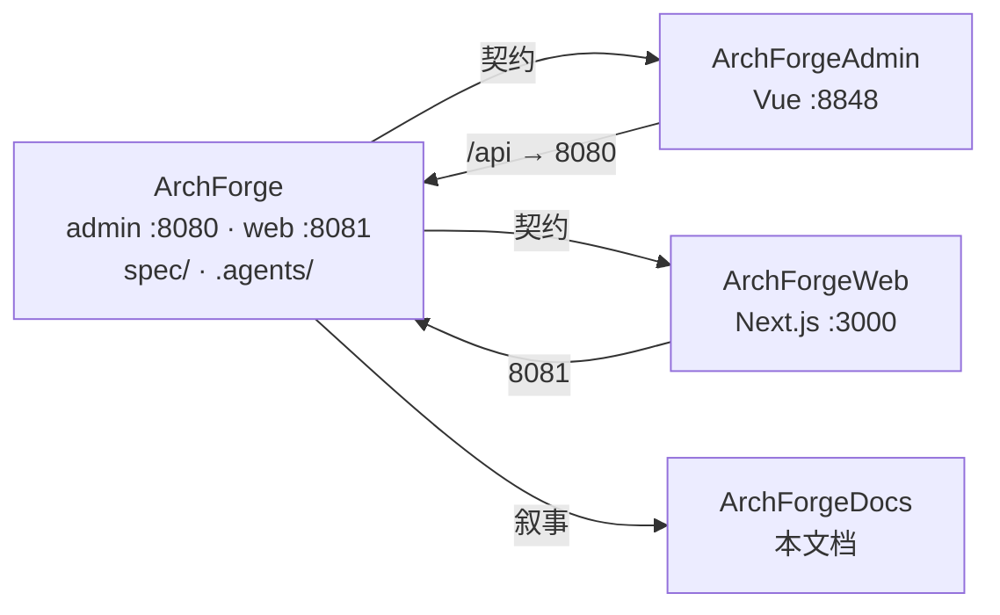

## 为什么是四个仓库？

ArchForge 由 **四个独立 Git 仓库** 组成，并列克隆，没有 git submodule。后端仓拥有契约（`spec/openapi.yaml`，由代码生成）和 AI 上下文（`repos.yaml`、`AGENTS.md`、`.agents/`），AI Agent 最先读它。原来的 ArchForgeSpec 仓已并入后端仓（[ADR-0012](https://github.com/sofn/ArchForge/blob/main/docs/adr/0012-sibling-repositories.md)）。


```mermaid
flowchart LR
  Backend["ArchForge<br/>admin :8080 · web :8081<br/>spec/ · .agents/"]
  Admin["ArchForgeAdmin<br/>Vue :8848"]
  Web["ArchForgeWeb<br/>Next.js :3000"]
  Docs["ArchForgeDocs<br/>本文档"]
  Backend -->|契约| Admin
  Backend -->|契约| Web
  Backend -->|叙事| Docs
  Admin -->|/api → 8080| Backend
  Web -->|8081| Backend
```

| 仓库 | 职责 | 本地端口 |
|------|------|----------|
| **ArchForge** | 后端。`archforge-server-admin` + `archforge-server-web` | `:8080` / `:8081` |
| **ArchForgeAdmin** | 管理端 UI（vue-pure-admin） | `:8848` → `:8080` |
| **ArchForgeWeb** | C 端（Next.js） | `:3000` → `:8081` |
| **ArchForgeDocs** | 本 VitePress 站点 | `npm run docs:dev` |

<p>
  <a href="https://github.com/sofn/ArchForge"></a>
</p>

先读 [契约先行](/zh/guide/contract-first)，再读 [AI 协作](/zh/guide/ai-workflow)。开发者 CLI 在后端仓：`./archforge`。

## 本地跑起来

```bash
git clone https://github.com/sofn/ArchForge.git
git clone https://github.com/sofn/ArchForgeAdmin.git
git clone https://github.com/sofn/ArchForgeWeb.git
git clone https://github.com/sofn/ArchForgeDocs.git

cd ArchForge
./archforge init --write
./archforge infra up
FILE_STORAGE_TYPE=local ./gradlew :archforge-server-admin:bootRun
```

默认管理员 `admin / admin123`（`dev` 开验证码）。目前没有公开托管 Demo，请本地或 Docker Compose 启动。
